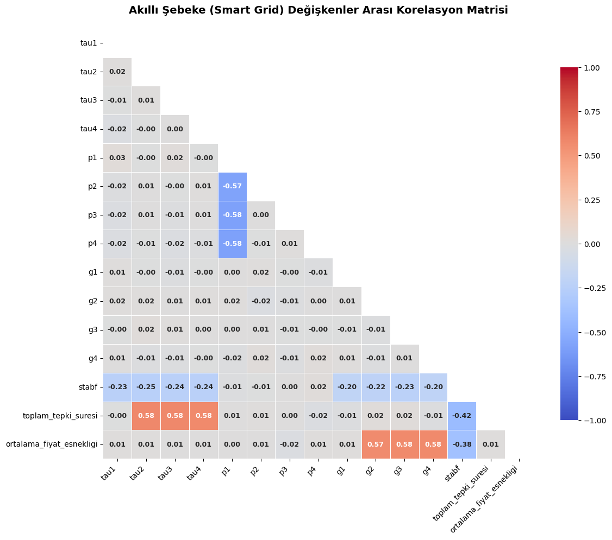
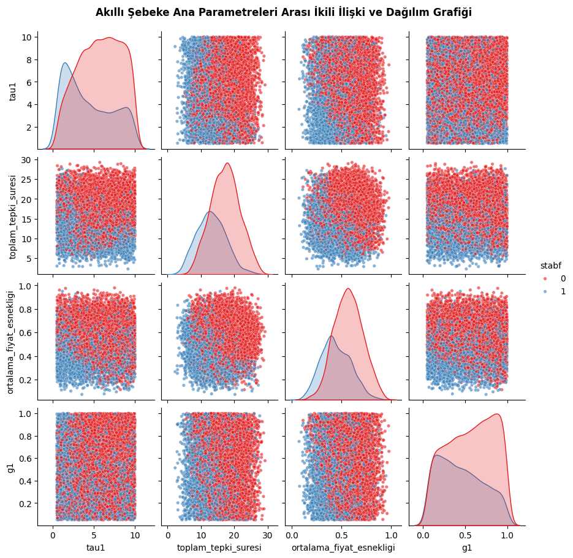
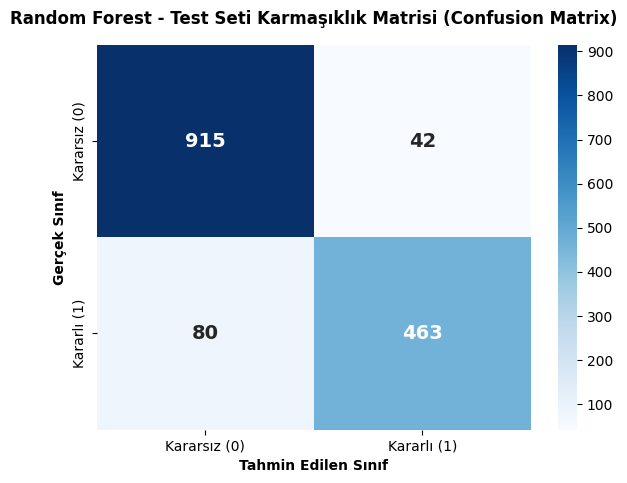
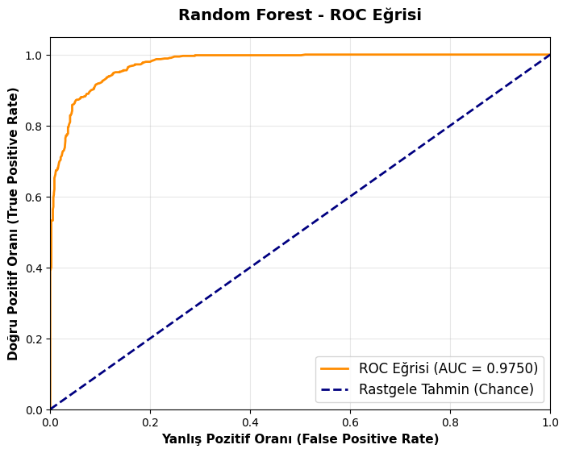
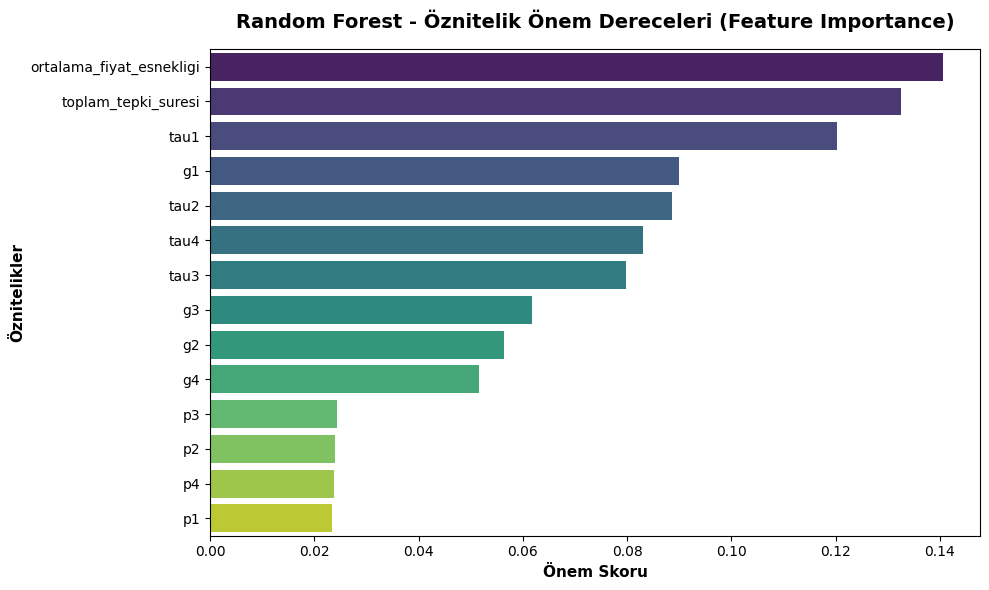
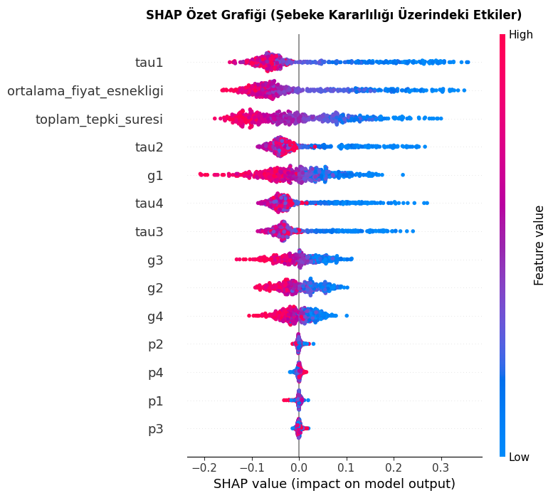

# ⚡ Akıllı Şebeke (Smart Grid) Kararlılık Tahmini

**Türkiye Yapay Zeka Akademisi - Uçtan Uca Makine Öğrenmesi Final Ödevi**

## 🎯 1. Projenin Amacı
Bu projenin amacı, akıllı elektrik şebekelerindeki (Smart Grid) güç dengesi, katılımcıların reaksiyon süreleri ve fiyat esneklik katsayılarına dayanarak şebekenin **"kararlı" (stable = 1)** veya **"kararsız" (unstable = 0)** olma durumunu tahmin eden uçtan uca bir İkili Sınıflandırma (Binary Classification) modeli geliştirmektir.

---

## 📊 2. Veri Seti Açıklaması ve Keşifsel Veri Analizi (EDA)
Kullanılan veri seti, [**Decentral Smart Grid Control (DSGC)**](https://archive.ics.uci.edu/dataset/471/electrical+grid+stability+simulated+data) simülasyonundan elde edilmiştir. 1 üretici ve 3 tüketici düğümünden (node) oluşan bir yıldız mimarisine dayanmaktadır. Toplam **10.000 satır** ve **13 öznitelik** barındırır.
* **Problem Türü:** İkili Sınıflandırma
* **Hedef Değişken:** `stabf` 

### A. Korelasyon Matrisi (Pearson Correlation)
* **Mekanizma:** Değişkenler arasındaki doğrusal ilişkinin gücünü ve yönünü (-1 ile +1 arasında) ölçer.
* **Grafik Okuması:** Hedef değişken (`stabf`) ile `tau` (tepki süresi) parametreleri arasında belirgin bir negatif korelasyon vardır.

### B. Pairplot (İkili İlişki ve Dağılım)
* **Mekanizma:** Çapraz eksenlerde Kernel Density Estimation (KDE) eğrileri ile verinin olasılık yoğunluğunu, kesişim eksenlerinde ise Scatter Plot ile kümelenme davranışını gösterir.
* **Grafik Okuması:** `tau1` ve `toplam_tepki_suresi` eksenlerinde mavi ve kırmızı renklerin net bir sınırla (decision boundary) ayrıldığı görülmektedir.

---

## ⚙️ 3. Veri Ön İşleme ve Öznitelik Mühendisliği
* **Eksik Değerler:** Veri setinde eksik değere rastlanmamıştır.
* **Aykırı Değerler (Outliers):** IQR yöntemi ile tespit edilmiş, ancak şebeke arızalarını temsil edebilecekleri fiziksel gerçekliği göz önüne alınarak veri setinde tutulmuştur.
* **Öznitelik Mühendisliği:** 
  1. `toplam_tepki_suresi` = tau2 + tau3 + tau4
  2. `ortalama_fiyat_esnekligi` = (g2 + g3 + g4) / 3
* **Ölçeklendirme:** Sayısal değişkenler `StandardScaler` (Z-Score) kullanılarak standartlaştırılmıştır.

---

## 🤖 4. Model Eğitimi, Karşılaştırma ve Hiperparametre Ayarı
Veri seti, stratify parametresi ile %70 Eğitim, %15 Doğrulama (Validation) ve %15 Test olarak ayrılmıştır.

* **Model Karşılaştırması (Validation Seti Üzerinde):**
  * Logistic Regression: ~%81.4 Accuracy
  * KNN: ~%85.0 Accuracy
  * **Random Forest: ~%91.4 Accuracy (En İyi Model)**

* **Hiperparametre Optimizasyonu (Grid Search CV):** Random Forest mekanizmasının (çoğunluk oyu tabanlı karar ağaçları topluluğu) aşırı öğrenmesini engellemek ve en iyi kombinasyonu bulmak için K-Fold Cross Validation uygulanmıştır.
  * *Seçilen Parametreler:* `max_depth: 20`, `min_samples_split: 2`, `n_estimators: 200`

---

## 🚀 5. Model Test Performansı ve Sonuç Değerlendirmesi
Optimize edilmiş Random Forest modelinin test verisi üzerindeki performansı:
* **Accuracy (Doğruluk):** ~%91.87
* **Precision:** ~0.9168
* **Recall:** ~0.8527
* **F1-Score:** ~0.8836

### A. Confusion Matrix (Karmaşıklık Matrisi)
* **Mekanizma:** Modelin yaptığı TP, TN, FP ve FN tahminlerini matris üzerinde gösterir.
* **Grafik Okuması:** Model, Kararsız (0) şebekeleri tahmin etmede olağanüstü başarılıdır, ancak az sayıda Kararlı (1) şebekeyi yanlışlıkla Kararsız olarak işaretlemiştir (Tip I Hatası).

### B. ROC Eğrisi ve AUC Skoru
* **Mekanizma:** Farklı eşik değerlerinde Doğru Pozitif Oranı ile Yanlış Pozitif Oranını grafiğe döker.
* **Grafik Okuması:** AUC skorumuzun **0.9750** olması, modelin sınıfları birbirinden ayırma kapasitesinin %97.5 gibi mükemmele yakın olduğunu kanıtlar.

---

## 🔎 6. Öznitelik Önem Dereceleri (Feature Importance)
* **Mekanizma:** Algoritma ağaçları bölerken her bir özniteliğin Gini Safsızlığını (Gini Impurity) ne kadar düşürdüğünü hesaplar.
* **Grafik Okuması:** Ürettiğimiz `ortalama_fiyat_esnekligi` ve `toplam_tepki_suresi` modelin en kritik karar noktaları olmuştur.

---

## 🧠 7. Explainable AI: SHAP Analizi (Bonus)
* **Mekanizma:** Oyun Teorisindeki Shapley Değerlerine dayanan SHAP, kara kutu olan modeli yorumlanabilir hale getirir.
* **Grafik Okuması:** Kırmızı noktalar "yüksek", mavi noktalar "düşük" değeri gösterir. Üretici ve tüketicilerin reaksiyon süreleri (`tau`) arttıkça (kırmızı), model doğrudan negatif yöne (0 = Kararsız) tahmin yapmaktadır.

---

## ⚠️ 8. Kısa Sonuç Yorumu, Modelin Sınırlılıkları ve Gelecek Çalışmalar
**Sonuç:** Elektrik mühendisliği dinamikleri temelinde; ağdaki üretim ve tüketim noktalarının tepki süresi (tau) uzadıkça şebeke doğrudan kararsızlığa sürüklenmektedir. Model, Grid Search sonrasında bu fiziksel davranışı mükemmel öğrenmiştir.

**Sınırlılıklar:**
* **Simülasyon Verisi:** Veri seti gerçek dünya ölçümlerinden ziyade bir DSGC simülasyonu çıktısıdır. Gerçek sistemlerdeki sensör gecikmeleri (latency) ve gürültüler (noise) performansı etkileyebilir.
* **Ağ Mimarisi:** Sadece 4 düğümlü (1 üretici, 3 tüketici) bir yıldız mimarisi modellenmiştir. Karmaşık çok üreticili ağ (mesh grid) yapılarında parametreler değişebilir.

**Gelecek Çalışmalar:** Test doğruluğunu artırmak için Derin Öğrenme (Deep Learning) veya XGBoost gibi Gradient Boosting algoritmaları denenebilir.

---

## 💻 9. Nasıl Çalıştırılır?
1. Python 3.8+ yüklü olduğundan emin olun.
2. Projeyi klonlayın ve terminal üzerinden kütüphaneleri kurun:
   `pip install -r requirements.txt`
3. Tüm dosyaların aynı klasörde olduğundan emin olun.
4. Jupyter Notebook üzerinden `Makine_Ogrenmesi_Final_Odevi.ipynb` dosyasını açarak hücreleri sırasıyla çalıştırın.

---
**Hazırlayan:** Aldy Muardi
